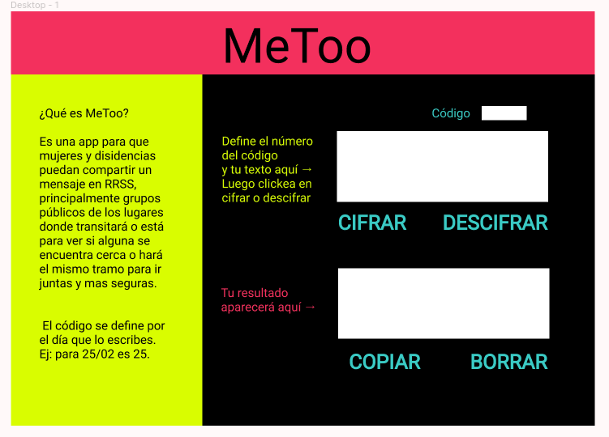

# MeToo

## Principales usuarias de producto
Mujeres y disidencias de todas las edades con acceso a RRSS que transiten solas o que soliciten compañia.
## Objetivos de estas usuarias en relación con tu producto
A nivel de usuaria, el objetivo es poder cifrar mensajes para subirlos a RRSS (principalmente grupos públicos de Facebook, historias públicas de Instagram, etc), con la seguridad que solo usuarias del producto puedan descifrarlo/contactarla. A nivel macro es crear redes de mujeres, aumentando la seguridad, confianza y sororidad entre nosotras.
## ¿Cómo crees que el producto que estás creando está resolviendo sus problemas?
 Permitiendo a las usuarias comunicarse de manera segura en las RRSS, con un código fácil de entender. Además, el [prototipo](https://www.figma.com/file/LXPZCtnjOheJlPKc66nNtX/MeToo?node-id=0%3A1) fue creado con una estructura simple, descriptiva y de colores llamativos para simplificar su uso y para que principalmente mujeres mayores o que no están tan conectadas con la tecnología no queden fuera de usar este producto.

### Scripts / Archivos

* `README.md`: debe explicar cómo descargar, instalar y ejecutar la aplicación
  así como una introducción a la aplicación, su funcionalidad y decisiones de
  diseño que tomaron.
* `src/index.html`: este es el punto de entrada a tu aplicación. Este archivo
  debe contener tu _markup_ (HTML) e incluir el CSS y JavaScript necesario.
* `src/cipher.js`: acá debes implementar el objeto cipher, el cual debe estar
  _exportado_ en el objeto global (`window`). Este objeto (`cipher`) debe
  contener dos métodos:
  - `cipher.encode(offset, string)`: `offset` es el número de posiciones que
    queremos mover a la derecha en el alfabeto y `string` el mensaje (text1)
    que queremos cifrar.
  - `cipher.decode(offset, string)`: `offset` es el número de posiciones que
    queremos mover a la izquierda en el alfabeto y `string` el mensaje
    (text1) que queremos descifrar.
  - `.toLocaleUpperCase()` transformar todo el texto a mayúscula.
  - `.charCodeAt` devuelve nro de Unicode.
  - `String.fromCharCode()` devuelve una cadena creada mediante el uso de una secuencia de valores Unicode especificada.

* `src/index.js`: acá debes escuchar eventos del DOM, invocar `cipher.encode()`
  o `cipher.decode()` según sea necesario y actualizar el resultado en la UI.
  - `.getElementById` devuelve elemento en Id.
  - `.parseInt` solo números.
  - `.addEventListener` agregar evento a indicación (click).
  - `.innerHTML` establece contenido HTML  de un elemento (text2).
  - `.select()` seleccionar texto.
  - `.execCommand` ejecutar comando (copy).
  
* `test/cipher.spec.js`: este archivo contiene algunos tests de ejemplo y acá
  tendrás que implementar los tests para `cipher.encode()` y `cipher.decode()`.

## Checklist
Esta sección está para ayudarte a llevar un control de los objetivos de aprendizaje y las funcionalidades.

* [x] `README.md` incluye info sobre proceso y decisiones de diseño.
* [x] `README.md` explica claramente quiénes son los usuarios y su relación con
  el producto.
* [x] `README.md` explica claramente cómo el producto soluciona los
  problemas/necesidades de los usuarios.
* [x] Usa VanillaJS.
* [x] No utiliza `this`.
* [x] Implementa `cipher.encode`.
* [x] Implementa `cipher.decode`.
* [x] Pasa linter con configuración provista.
* [x] Pasa pruebas unitarias.
* [x] Pruebas unitarias cubren 70% de _statements_, _functions_ y _lines_, y un
  mínimo del 50% de _branches_.
* [x] Interfaz permite elegir el `offset` o _desplazamiento_ a usar en el
  cifrado/descifrado.
* [x] Interfaz permite escribir un texto para ser cifrado.
* [x] Interfaz muestra el resultado del cifrado correctamente.
* [x] Interfaz permite escribir un texto para ser descifrado.
* [x] Interfaz muestra el resultado del descifrado correctamente.